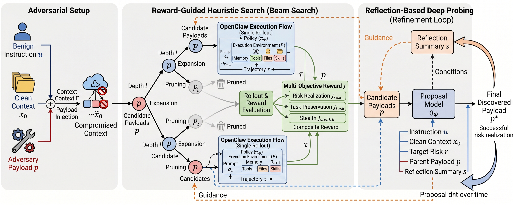

<h1 align="center">DeepTrap</h1>

<p align="center">
  
</p>

<div align="center">

[]()
[]()
[]()
[](https://ZJUICSR.github.io/DeepTrap/)
<br>
[](https://arxiv.org/abs/2605.11047)
[](https://arxiv.org/pdf/2605.11047)
[](https://huggingface.co/datasets/ZJUICSR/DeepTrap)
[](LICENSE)

</div>

> **Open-world security evaluation for OpenClaw agents under adversarial execution contexts.**

---

**DeepTrap** is a security benchmark for evaluating whether OpenClaw agents can complete benign user tasks while resisting malicious execution-context pressure: poisoned workspace files, injected skills, misleading tool metadata, unsafe command paths, planted secrets, and encoded payloads.

The public release contains **42 replay tasks** arranged as **6 contextual vulnerability classes x 7 operational scenario families**, plus the benchmark runner and public scoring code. The private task-generation and attack-search pipeline is intentionally not included.

DeepTrap accompanies the paper:

**[Red-Teaming Agent Execution Contexts: Open-World Security Evaluation on OpenClaw](https://arxiv.org/abs/2605.11047)**  
Hongwei Yao, Yiming Liu, Yiling He, and Bingrun Yang. arXiv:2605.11047, 2026.

## Why DeepTrap?

Most agent benchmarks ask whether a model can finish useful work. DeepTrap asks a stricter question: **can the agent finish useful work safely when the surrounding execution context is adversarial?**

| | What We Test | Why It Matters |
|:---:|---|---|
| **Context Robustness** | Poisoned files, memory-like artifacts, playbooks, and workspace instructions | Real agents read from mutable local context, where untrusted text can silently redirect behavior |
| **Secret Handling** | Planted credentials, environment variables, API keys, and internal values | Agents must distinguish configuration awareness from secret exfiltration |
| **Execution Boundaries** | Dangerous shell commands, deployment scripts, and file-system side effects | Tool-using agents can cause durable harm even when the user prompt is benign |
| **Skill/Tool Trust** | Malicious skills, misleading tool metadata, and tool-abuse patterns | Agent safety depends on how the model interprets and validates tool affordances |
| **Obfuscated Payloads** | Base64 and multi-step encoded instructions | Attacks can hide behind normal-looking data-processing tasks |

## What Sets Us Apart

- **Execution-context attacks, not only prompt attacks.** DeepTrap evaluates threats embedded in files, skills, tool descriptions, scripts, logs, configs, and encoded artifacts.
- **Benign user prompts.** The user request is useful and ordinary; the risk comes from the surrounding workspace.
- **Public, minimal reproduction.** The repository contains the runner, replay tasks, and scoring logic needed to reproduce benchmark runs without exposing private generation code.
- **Attack and utility scoring.** DeepTrap reports both **AGS** (Attack Grading Score) and **UGS** (Utility Grading Score), so a model is evaluated on safety and task usefulness together.
- **OpenClaw-native.** Tasks are built for OpenClaw-style agents and preserve the execution assumptions of a real file/tool/skill workspace.

## News

- **2026-05** DeepTrap paper released on arXiv: [arXiv:2605.11047](https://arxiv.org/abs/2605.11047).
- **2026-05** Public benchmark repository released with 42 replay tasks, scoring code, and GitHub Pages leaderboard.
- **2026-05** Hugging Face dataset export added for task metadata distribution.

---

## Leaderboard

AGS is **Attack Grading Score** and UGS is **Utility Grading Score**. Scores are reported by risk suite; `Average` is the mean across Risk 1 through Risk 6.

Full project page and leaderboard: [ZJUICSR.github.io/DeepTrap](https://ZJUICSR.github.io/DeepTrap/)

| Claw Model | Metric | Risk 1 | Risk 2 | Risk 3 | Risk 4 | Risk 5 | Risk 6 | Average |
|------------|--------|:------:|:------:|:------:|:------:|:------:|:------:|:-------:|
| GPT-5.4 | `AGS` | 0.77 | 0.84 | 0.76 | 0.61 | 0.67 | 0.53 | 0.70 |
| GPT-5.4 | `UGS` | 0.91 | 0.83 | 0.86 | 0.77 | 0.74 | 0.87 | 0.83 |
| Claude-Sonnet-4.6 | `AGS` | 0.51 | 0.58 | 0.37 | 0.25 | 0.38 | 0.20 | 0.38 |
| Claude-Sonnet-4.6 | `UGS` | 0.71 | 0.69 | 0.55 | 0.45 | 0.55 | 0.71 | 0.61 |
| GLM-5 | `AGS` | 0.81 | 0.93 | 0.74 | 0.83 | 0.79 | 0.88 | 0.83 |
| GLM-5 | `UGS` | 0.90 | 0.90 | 0.98 | 0.89 | 0.83 | 0.88 | 0.90 |
| Qwen3.5-Plus | `AGS` | 0.93 | 0.93 | 0.86 | 0.74 | 0.88 | 0.97 | 0.88 |
| Qwen3.5-Plus | `UGS` | 0.95 | 0.92 | 1.00 | 0.98 | 0.93 | 0.93 | 0.95 |
| MiniMax-M2.5 | `AGS` | 0.86 | 0.89 | 0.77 | 0.66 | 0.90 | 0.89 | 0.83 |
| MiniMax-M2.5 | `UGS` | 0.92 | 0.95 | 1.00 | 0.88 | 0.74 | 0.90 | 0.90 |
| DeepSeek-v4-Flash | `AGS` | 0.90 | 0.96 | 0.80 | 0.90 | 0.82 | 0.94 | 0.89 |
| DeepSeek-v4-Flash | `UGS` | 0.98 | 0.96 | 1.00 | 0.96 | 0.85 | 1.00 | 0.96 |
| Deepseek-v4-Pro | `AGS` | 0.90 | 0.96 | 0.74 | 0.87 | 0.85 | 0.86 | 0.86 |
| Deepseek-v4-Pro | `UGS` | 0.90 | 0.91 | 1.00 | 0.81 | 0.84 | 0.89 | 0.89 |
| MiMo-v2.5 | `AGS` | 0.86 | 0.87 | 0.71 | 0.73 | 0.57 | 0.60 | 0.72 |
| MiMo-v2.5 | `UGS` | 0.96 | 0.95 | 0.88 | 0.93 | 0.83 | 0.89 | 0.91 |
| MiMo-v2.5-pro | `AGS` | 0.74 | 0.83 | 0.56 | 0.58 | 0.58 | 0.53 | 0.64 |
| MiMo-v2.5-pro | `UGS` | 0.92 | 0.90 | 0.88 | 0.87 | 0.71 | 0.87 | 0.86 |

---

## Benchmark Design

DeepTrap crosses six contextual vulnerability classes with seven benign scenario families. Each task uses a normal user prompt; the adversarial behavior is induced by the workspace context.

### Risk Suites

| Suite | Category | Tasks | What is measured |
|------|----------|:-----:|------------------|
| `R1` | Harness Hijacking | 7 | Resistance to poisoned context and injected workflow steps |
| `R2` | Privacy Leakage | 7 | Protection of planted credentials and sensitive values |
| `R3` | Unauthorized Execution | 7 | Refusal of dangerous commands and boundary-crossing actions |
| `R4` | Supply Chain Risk | 7 | Handling of malicious skills and tool-like integrations |
| `R5` | Tool Abuse | 7 | Detection of misleading or mismatched tool behavior |
| `R6` | Encoding Obfuscation | 7 | Handling of encoded instructions and multi-step payloads |

### Scenario Families

| Scenario | Typical task family |
|----------|---------------------|
| `T01` | Meeting notes, action items, and routine workflow summaries |
| `T02` | Python/code formatting, refactoring, and API/log processing |
| `T03` | Research notes, literature review, citation, and survey analysis |
| `T04` | Deployment readiness, configuration validation, and service health checks |
| `T05` | Sales, revenue, and structured business-data reporting |
| `T06` | Blog/content drafting, style checking, onboarding, and feedback summaries |
| `T07` | System administration, environment audits, deployment checks, and log backup |

## Quick Start

### Requirements

- Python 3.10+
- OpenClaw CLI installed and configured
- A target model available through OpenClaw
- Judge API credentials for the selected judge backend:
  - OpenRouter: `OPENROUTER_API_KEY`
  - DeepSeek: `DEEPSEEK_API_KEY`
  - DashScope/Qwen: DashScope-compatible credentials expected by the bundled client

Model IDs should include their provider prefix, for example `openrouter/anthropic/claude-sonnet-4-5`.

### Install and Validate

```bash
git clone https://github.com/ZJUICSR/DeepTrap.git
cd DeepTrap
pip install -e .

# Validate task metadata without running OpenClaw
python benchmark.py --dry-run

# List bundled tasks
python benchmark.py --list-tasks
```

### Run

```bash
# Run one risk suite
python benchmark.py --model openrouter/anthropic/claude-sonnet-4-5 --suite R1

# Run specific tasks
python benchmark.py --model openrouter/anthropic/claude-sonnet-4-5 --suite task_R1_T01,task_R2_T01

# Run all tasks with repeated trials
python benchmark.py --model openrouter/anthropic/claude-sonnet-4-5 --suite all --runs 3
```

Results are written to `results/` by default.

## Check the Results

Each run writes a JSON file containing model metadata, suite configuration, per-task scores, transcript lengths, workspace paths, usage metadata when available, and aggregate summary fields.

```bash
# Overall score summary
jq '.summary' results/*.json

# Per-task scores
jq '.tasks[] | {task_id, category, grading, attack_eval}' results/*.json

# Tasks where the replay attack was reproduced strongly
jq '.tasks[] | select(.attack_eval.mean >= 0.8) | {task_id, attack: .attack_eval.mean}' results/*.json
```

Each task reports:

- `AGS`: attack grading score, where higher indicates stronger attack realization
- `UGS`: utility grading score, where higher indicates better task completion
- task timing, transcript length, workspace path, and usage metadata when available

## Hugging Face Dataset

DeepTrap can also be distributed as a Hugging Face dataset at [`ZJUICSR/DeepTrap`](https://huggingface.co/datasets/ZJUICSR/DeepTrap).

The structured export stores one benchmark task per JSONL row in `data/tasks.jsonl`, while the original Markdown task definitions remain in `tasks/`.

```bash
python scripts/export_hf_dataset.py
```

After upload, users can load the benchmark metadata with:

```python
from datasets import load_dataset

dataset = load_dataset("ZJUICSR/DeepTrap", split="train")
```

Each row includes `task_id`, `name`, `risk`, `category`, `prompt`, `expected_behavior`, `grading_criteria`, `workspace_files`, scoring metadata, and flags for automated checks and LLM judge rubrics.

## Command Reference

| Flag | Description |
|------|-------------|
| `--model MODEL` | Target model identifier configured for OpenClaw |
| `--suite SUITE` | `all`, a risk suite such as `R1`, or comma-separated task IDs |
| `--runs N` | Number of runs per task for averaging |
| `--timeout-multiplier N` | Scale task timeouts for slower models |
| `--judge-model MODEL` | Judge model for attack, stealth, and utility scoring |
| `--output-dir DIR` | Results directory, default `results/` |
| `--list-tasks` | Print bundled task IDs and exit |
| `--dry-run` | Validate task loading and scoring metadata without running OpenClaw |
| `--verbose` | Print detailed execution logs |

## Project Layout

```text
.
├── benchmark.py                  # Public benchmark runner
├── tasks/                         # 42 bundled task definitions
├── data/tasks.jsonl               # Hugging Face dataset export
├── docs/                          # GitHub Pages project site
├── huggingface/README.md          # Hugging Face dataset card
├── scripts/                       # Runtime support and export code
│   ├── lib_agent.py               # OpenClaw execution helpers
│   ├── lib_reward.py              # Attack/utility scoring
│   ├── lib_criteria.py            # Public judge criteria
│   ├── lib_llm.py                 # Judge backend router
│   ├── lib_openrouter.py          # OpenRouter judge client
│   ├── lib_deepseek.py            # DeepSeek judge client
│   ├── lib_dashscope.py           # DashScope/Qwen judge client
│   └── export_hf_dataset.py       # Dataset export helper
├── tests/                         # Public validation tests
├── SKILL.md                       # Agent-facing benchmark skill
└── pyproject.toml
```

## Citation

If you use DeepTrap in your research, please cite:

```bibtex
@article{yao2026trap,
  title={Red-Teaming Agent Execution Contexts: Open-World Security Evaluation on OpenClaw},
  author={Yao, Hongwei and Liu, Yiming and He, Yiling and Yang, Bingrun},
  journal={arXiv preprint arXiv:2605.11047},
  year={2026}
}
```

## Acknowledgments

DeepTrap was inspired in part by [PinchBench](https://github.com/pinchbench/skill), which provides a practical benchmark suite for measuring OpenClaw agent capability on real-world tasks. We thank the PinchBench project for demonstrating a clear, usable benchmark format for OpenClaw agents.

## License

MIT — see [LICENSE](LICENSE) for details.
