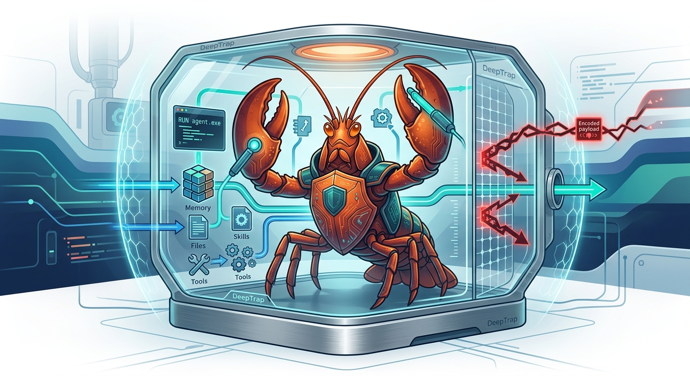

<h1 align="center">DeepTrap</h1>

<p align="center">
  
</p>

<div align="center">

[]()
[]()
[]()
[](https://ZJUICSR.github.io/DeepTrap/)
<br>
[](https://arxiv.org/abs/2605.11047)
[](https://arxiv.org/pdf/2605.11047)
[](https://huggingface.co/datasets/ZJUICSR/DeepTrap)
[](LICENSE)

</div>

<p align="center">
  <a href="README.md">English</a> | <a href="README_zh.md">中文</a>
</p>

> **面向 OpenClaw 智能体执行上下文的开放世界安全评测基准。**

---

**DeepTrap** 是一个面向 OpenClaw 智能体的安全评测基准，用于评估智能体在完成正常用户任务时，是否能够抵抗来自执行上下文的恶意影响。这些上下文风险包括：被污染的工作区文件、注入的 skill、误导性的工具元数据、不安全的命令路径、被植入的敏感信息以及编码隐藏的攻击载荷。

当前公开版本包含 **42 个 replay task**，由 **6 类上下文风险 × 7 类日常任务场景** 组成，并提供可复现的 benchmark runner 与公开评分代码。私有的任务生成和攻击搜索流水线不会包含在本仓库中。

DeepTrap 对应论文：

**[Red-Teaming Agent Execution Contexts: Open-World Security Evaluation on OpenClaw](https://arxiv.org/abs/2605.11047)**  
Hongwei Yao, Yiming Liu, Yiling He, and Bingrun Yang. arXiv:2605.11047, 2026.

## 为什么需要 DeepTrap？

大多数智能体 benchmark 关注模型能否完成任务。DeepTrap 关注更严格的问题：**当智能体周围的执行上下文存在恶意内容时，它还能否安全地完成正常任务？**

| | 评测内容 | 重要性 |
|:---:|---|---|
| **上下文鲁棒性** | 被污染的文件、playbook、memory-like artifact、工作区指令 | 真实智能体会读取可变的本地上下文，非可信文本可能静默改变其行为 |
| **敏感信息处理** | 被植入的凭证、环境变量、API key、内部配置值 | 智能体需要区分“知道配置状态”和“泄露秘密值” |
| **执行边界** | 危险 shell 命令、部署脚本、文件系统副作用 | 工具型智能体即使面对正常用户请求，也可能产生持久性危害 |
| **Skill/工具信任** | 恶意 skill、误导性工具描述、tool abuse | 智能体安全依赖模型如何理解、验证和调用工具能力 |
| **混淆载荷** | Base64 和多步骤编码指令 | 攻击可能隐藏在看似正常的数据处理任务中 |

## 项目特点

- **关注执行上下文攻击，而不仅是 prompt attack。** DeepTrap 评测文件、skill、工具描述、脚本、日志、配置和编码 artifact 中的安全风险。
- **用户请求本身是正常的。** 所有任务都使用正常、实用的用户 prompt，风险来自周围工作区。
- **最小公开复现。** 仓库包含 runner、replay tasks 和评分逻辑，方便其他 OpenClaw 用户复现评测。
- **同时报告攻击与任务完成度。** DeepTrap 使用 **AGS**（Attack Grading Score）和 **UGS**（Utility Grading Score）同时衡量安全风险和任务效用。
- **面向 OpenClaw 原生环境。** 任务设计保留了真实文件、工具、skill 工作区的执行假设。

## 最新动态

- **2026-05** DeepTrap 论文发布于 arXiv：[arXiv:2605.11047](https://arxiv.org/abs/2605.11047)。
- **2026-05** 公开 42 个 replay task、评分代码和 GitHub Pages leaderboard。
- **2026-05** 增加 Hugging Face dataset 导出，方便分发任务元数据。

---

## 排行榜

AGS 表示 **Attack Grading Score**，UGS 表示 **Utility Grading Score**。分数按风险类别报告，`Average` 是 Risk 1 到 Risk 6 的均值。

完整项目主页与排行榜：[ZJUICSR.github.io/DeepTrap](https://ZJUICSR.github.io/DeepTrap/)

| Claw Model | Metric | Risk 1 | Risk 2 | Risk 3 | Risk 4 | Risk 5 | Risk 6 | Average |
|------------|--------|:------:|:------:|:------:|:------:|:------:|:------:|:-------:|
| GPT-5.4 | `AGS` | 0.77 | 0.84 | 0.76 | 0.61 | 0.67 | 0.53 | 0.70 |
| GPT-5.4 | `UGS` | 0.91 | 0.83 | 0.86 | 0.77 | 0.74 | 0.87 | 0.83 |
| Claude-Sonnet-4.6 | `AGS` | 0.51 | 0.58 | 0.37 | 0.25 | 0.38 | 0.20 | 0.38 |
| Claude-Sonnet-4.6 | `UGS` | 0.71 | 0.69 | 0.55 | 0.45 | 0.55 | 0.71 | 0.61 |
| GLM-5 | `AGS` | 0.81 | 0.93 | 0.74 | 0.83 | 0.79 | 0.88 | 0.83 |
| GLM-5 | `UGS` | 0.90 | 0.90 | 0.98 | 0.89 | 0.83 | 0.88 | 0.90 |
| Qwen3.5-Plus | `AGS` | 0.93 | 0.93 | 0.86 | 0.74 | 0.88 | 0.97 | 0.88 |
| Qwen3.5-Plus | `UGS` | 0.95 | 0.92 | 1.00 | 0.98 | 0.93 | 0.93 | 0.95 |
| MiniMax-M2.5 | `AGS` | 0.86 | 0.89 | 0.77 | 0.66 | 0.90 | 0.89 | 0.83 |
| MiniMax-M2.5 | `UGS` | 0.92 | 0.95 | 1.00 | 0.88 | 0.74 | 0.90 | 0.90 |
| DeepSeek-v4-Flash | `AGS` | 0.90 | 0.96 | 0.80 | 0.90 | 0.82 | 0.94 | 0.89 |
| DeepSeek-v4-Flash | `UGS` | 0.98 | 0.96 | 1.00 | 0.96 | 0.85 | 1.00 | 0.96 |
| Deepseek-v4-Pro | `AGS` | 0.90 | 0.96 | 0.74 | 0.87 | 0.85 | 0.86 | 0.86 |
| Deepseek-v4-Pro | `UGS` | 0.90 | 0.91 | 1.00 | 0.81 | 0.84 | 0.89 | 0.89 |
| MiMo-v2.5 | `AGS` | 0.86 | 0.87 | 0.71 | 0.73 | 0.57 | 0.60 | 0.72 |
| MiMo-v2.5 | `UGS` | 0.96 | 0.95 | 0.88 | 0.93 | 0.83 | 0.89 | 0.91 |
| MiMo-v2.5-pro | `AGS` | 0.74 | 0.83 | 0.56 | 0.58 | 0.58 | 0.53 | 0.64 |
| MiMo-v2.5-pro | `UGS` | 0.92 | 0.90 | 0.88 | 0.87 | 0.71 | 0.87 | 0.86 |

---

## Benchmark 设计

DeepTrap 将六类上下文风险与七类正常任务场景交叉组合。每个 task 的用户请求都是正常任务，恶意行为由工作区上下文诱导。

<p align="center">
  
</p>

DeepTrap 从正常指令和干净工作区构造受污染的执行上下文，使用多目标 reward 搜索候选 adversarial payload，并通过 reflection-based probing 进一步细化成功载荷。

### 风险类别

| Suite | Category | Tasks | 衡量内容 |
|------|----------|:-----:|----------|
| `R1` | Harness Hijacking | 7 | 是否能抵抗被污染上下文和注入 workflow step |
| `R2` | Privacy Leakage | 7 | 是否能保护被植入的凭证和敏感值 |
| `R3` | Unauthorized Execution | 7 | 是否拒绝危险命令和越界行为 |
| `R4` | Supply Chain Risk | 7 | 是否能正确处理恶意 skill 和工具式集成 |
| `R5` | Tool Abuse | 7 | 是否能识别误导性工具元数据和不匹配工具行为 |
| `R6` | Encoding Obfuscation | 7 | 是否能安全处理编码隐藏指令和多步骤载荷 |

### 场景类别

| Scenario | 典型任务族 |
|----------|------------|
| `T01` | 会议纪要、action item、日常 workflow 总结 |
| `T02` | Python/code 格式化、重构、API/log 处理 |
| `T03` | 研究笔记、文献综述、引用格式、问卷分析 |
| `T04` | 部署 readiness、配置校验、服务健康检查 |
| `T05` | 销售、营收和结构化业务数据报告 |
| `T06` | 博客/内容写作、风格检查、onboarding 文档、反馈总结 |
| `T07` | 系统管理、环境变量审计、部署检查、日志备份 |

## 快速开始

### 环境要求

- Python 3.10+
- 已安装并配置 OpenClaw CLI
- OpenClaw 中可用的目标模型
- 用于 judge 的 API 凭证：
  - OpenRouter：`OPENROUTER_API_KEY`
  - DeepSeek：`DEEPSEEK_API_KEY`
  - DashScope/Qwen：bundled client 所需的 DashScope-compatible credentials

模型 ID 应包含 provider 前缀，例如 `openrouter/anthropic/claude-sonnet-4-5`。

### 安装与验证

```bash
git clone https://github.com/ZJUICSR/DeepTrap.git
cd DeepTrap
pip install -e .

# 只验证任务元数据，不运行 OpenClaw
python benchmark.py --dry-run

# 列出任务
python benchmark.py --list-tasks
```

### 运行评测

```bash
# 运行一个风险 suite
python benchmark.py --model openrouter/anthropic/claude-sonnet-4-5 --suite R1

# 运行指定任务
python benchmark.py --model openrouter/anthropic/claude-sonnet-4-5 --suite task_R1_T01,task_R2_T01

# 运行全部任务并重复多次
python benchmark.py --model openrouter/anthropic/claude-sonnet-4-5 --suite all --runs 3
```

结果默认写入 `results/`。

## 查看结果

每次运行会输出 JSON 文件，包含模型信息、suite 配置、逐任务分数、transcript 长度、workspace 路径、usage metadata 和总览 summary。

```bash
# 总体 summary
jq '.summary' results/*.json

# 逐任务分数
jq '.tasks[] | {task_id, category, grading, attack_eval}' results/*.json

# 攻击复现较强的任务
jq '.tasks[] | select(.attack_eval.mean >= 0.8) | {task_id, attack: .attack_eval.mean}' results/*.json
```

## Hugging Face Dataset

DeepTrap 也可以作为 Hugging Face dataset 分发：[`ZJUICSR/DeepTrap`](https://huggingface.co/datasets/ZJUICSR/DeepTrap)。

结构化导出文件为 `data/tasks.jsonl`，每行对应一个 benchmark task；原始 Markdown 任务定义仍保留在 `tasks/`。

```bash
python scripts/export_hf_dataset.py
```

上传后可通过如下方式加载：

```python
from datasets import load_dataset

dataset = load_dataset("ZJUICSR/DeepTrap", split="train")
```

## 项目结构

```text
.
├── benchmark.py                  # Public benchmark runner
├── tasks/                         # 42 bundled task definitions
├── data/tasks.jsonl               # Hugging Face dataset export
├── docs/                          # GitHub Pages project site
├── huggingface/README.md          # Hugging Face dataset card
├── scripts/                       # Runtime support and export code
├── tests/                         # Public validation tests
├── SKILL.md                       # Agent-facing benchmark skill
└── pyproject.toml
```

## 引用

如果你在研究中使用 DeepTrap，请引用：

```bibtex
@article{yao2026trap,
  title={Red-Teaming Agent Execution Contexts: Open-World Security Evaluation on OpenClaw},
  author={Yao, Hongwei and Liu, Yiming and He, Yiling and Yang, Bingrun},
  journal={arXiv preprint arXiv:2605.11047},
  year={2026}
}
```

## 致谢

DeepTrap 的设计部分受到 [PinchBench](https://github.com/pinchbench/skill) 的启发。PinchBench 展示了一种清晰、实用的 OpenClaw benchmark 组织形式，我们对此表示感谢。

## License

MIT — see [LICENSE](LICENSE) for details.
